# At the Vet

*Note: This markdown files contains the questions as well as the expected outputs of the queries you need to run in order to answer them.*

You are assisting a vet clinic in making sense of their data. Their data is in two tables. And they need you tu perform the following analytics:

1. How many pets, how many owners? Hint: [COUNT()](https://www.postgresql.org/docs/8.2/functions-aggregate.html)

SELECT COUNT (*) 
FROM owners;

SELECT COUNT(*)
from pets;
 
Expected output pets:

Expected output owners:

2. What are the most and least common pet names? Hint: [ORDER BY](https://www.postgresql.org/docs/8.1/queries-order.html)

SELECT name,
      COUNT(*)
FROM pets 
GROUP BY name
ORDER BY COUNT(*) DESC
LIMIT 1;

SELECT name,
      COUNT(*)
FROM pets 
GROUP BY name
ORDER BY COUNT(*) ASC
LIMIT 1;

Expected Output most common name: 

Expected Output least common name: 
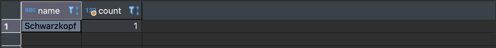

3. What kind of pets do we have? Hint: [DISTINCT](https://www.postgresql.org/docs/9.5/sql-select.html)
   
Expected output:
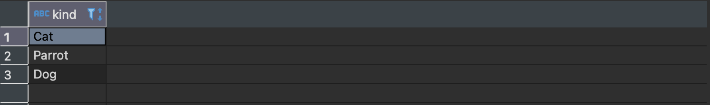

SELECT DISTINCT kind
FROM pets;

4. What is the gender balance across pets and species? Hint: [GROUP BY](https://www.postgresql.org/docs/9.4/tutorial-agg.html)

SELECT gender,
       count(*)
FROM pets 
GROUP BY gender;

SELECT kind,
       gender,
       count(*)
FROM pets 
GROUP BY kind,gender;

Expected output gender balance pets:
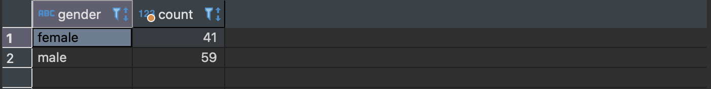
Expected output gender balance pets by kind:
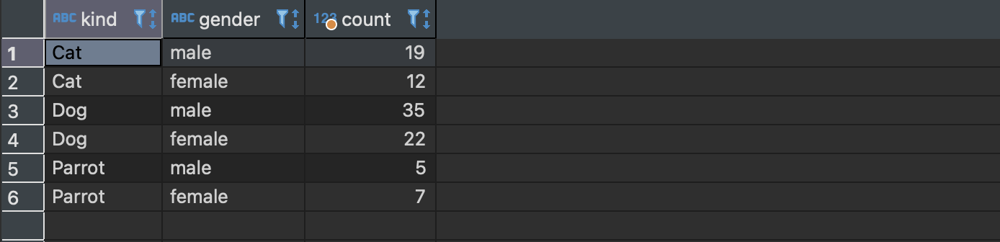

5. What is the average age of the pets? Hint: [AVG()](https://www.postgresql.org/docs/9.4/tutorial-agg.html)

SELECT avg(age)
FROM pets;

Expected output: 
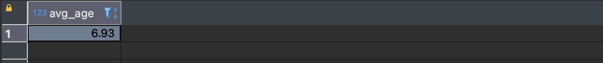

6. How many owners have more than one pet? Hint: [GROUP BY HAVING](https://www.postgresql.org/docs/9.4/tutorial-agg.html)

SELECT COUNT(*) 
FROM (
SELECT ownerid
FROM pets       
GROUP BY ownerid
HAVING count(*) > 1
) AS owners;

Expected output: 

7. Do the owners that have more than one pet have the same kind of pet. [ARRAY_AGG](https://www.postgresqltutorial.com/postgresql-aggregate-functions/postgresql-array_agg/)

SELECT ARRAY_AGG (kind) actors,
       ownerid 
FROM pets 
GROUP BY ownerid
HAVING count(*) > 1;

Expected output (one possible approach): 
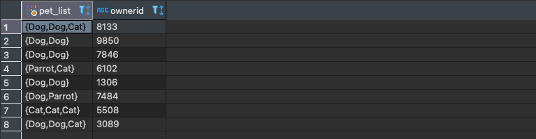

8. Do owners name their pets after themselves? If so, who are they? Find their names! Hint: [INNER JOIN](https://www.postgresql.org/docs/8.3/tutorial-join.html)

SELECT o.name AS Owner_name,
       p.name AS Pet_name
FROM owners AS o
INNER JOIN pets p 
ON o.ownerid = p.ownerid
AND o.name = p.name;

Expected output: 

9.  Extract the information of pet names and owners side-by-side! Hint: [FULL JOIN](https://www.postgresql.org/docs/8.3/tutorial-join.html)

SELECT o.name AS Owner_name,
       p.name AS Pet_name,
       o.ownerid
FROM owners AS o
FULL JOIN pets p 
ON o.ownerid = p.ownerid;

Expected output (only first rows shown):
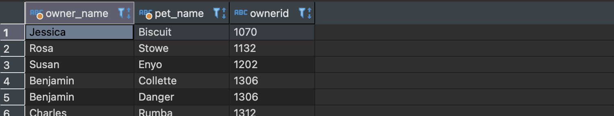

10.  What are the cities with the largest amount (top 3) of pets? Hint: [INNER JOIN](https://www.postgresql.org/docs/8.3/tutorial-join.html)

Expected output: 
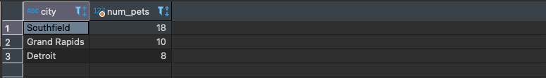

SELECT o.city,
       count(*)
FROM owners AS o
INNER JOIN pets p 
ON o.ownerid = p.ownerid
GROUP BY o.city
ORDER BY count(*) DESC
LIMIT(3);

## Let's look at some of the procedures those pets had.

1. Combine the tables with the procedure history and the procedure details. You might have to join tables based on more than one column... Hint: Consider ALL petid's

SELECT * 
FROM procedurehistory AS ph
INNER JOIN proceduredetails AS pd
ON ph.proceduretype = pd.proceduretype AND 
   ph.proceduresubcode = pd.proceduresubcode;

Expected output (one possible approach): 
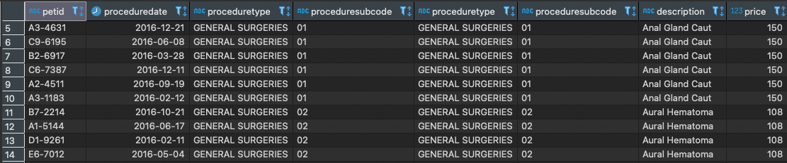

2. What pets didn't get rabies vaccination? Hint: [LEFT JOIN](https://www.postgresql.org/docs/8.3/tutorial-join.html), [ARRAY_AGG()](https://www.postgresql.org/docs/8.2/functions-aggregate.html) and [ALL()](https://www.postgresql.org/docs/9.1/functions-comparisons.html).
   de
Expected output (first part): 
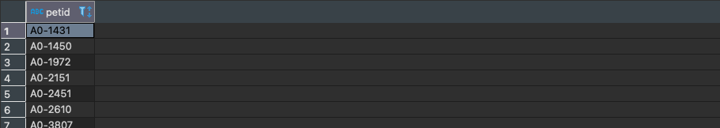

SELECT t.petid from (
SELECT * FROM procedurehistory p 
LEFT JOIN proceduredetails p2 
ON p.proceduretype = p2.proceduretype AND p.proceduresubcode = p2.proceduresubcode) t
GROUP BY t.petid
HAVING 'Rabies' != ALL(array_agg(t.description)) ;

3. What is the most prevalent type of surgery? Hint: [IS NOT NULL](https://www.postgresql.org/docs/8.3/functions-comparison.html)

SELECT pd.description,
       count(*)
FROM procedurehistory AS ph
INNER JOIN proceduredetails AS pd
ON ph.proceduretype = pd.proceduretype AND 
   ph.proceduresubcode = pd.proceduresubcode 
WHERE ph.proceduretype = 'GENERAL SURGERIES'
GROUP BY pd.description   
ORDER BY count(*) DESC
LIMIT(1);
   

Expected output: 
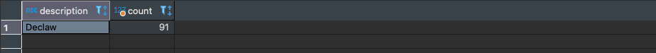

4. What owner spent the most on their pet and how much was it? Hint: [SUM()](https://www.postgresql.org/docs/8.2/functions-aggregate.html)

SELECT p.ownerid,
       SUM(pd.price)
FROM procedurehistory AS ph
INNER JOIN proceduredetails AS pd
ON ph.proceduretype = pd.proceduretype AND 
   ph.proceduresubcode = pd.proceduresubcode 
INNER JOIN pets AS p
ON p.petid = ph.petid
GROUP BY p.ownerid
ORDER BY SUM(pd.price) DESC
LIMIT 1;

Expected output: 
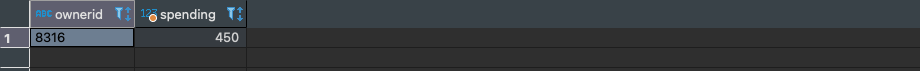

5. Look at the data and ask yourself what more questions one could ask!
